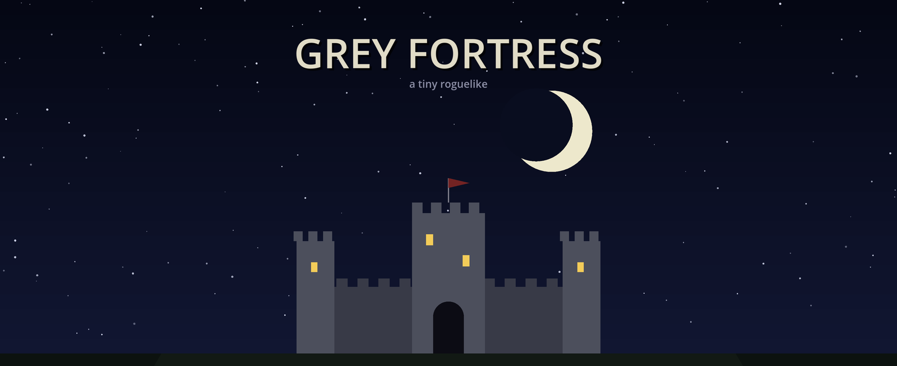

# Grey Fortress



A turn-based roguelike prototype in the style of Castle of the Winds,
built with Godot 4. Desktop-only, targeting a Steam release (the Android
export was removed).

## The story (spoilers)

Grey Fortress Town sits in the shadow of the fortress it is named
for, looming on its hill just east of the walls — and no one talks
about it. The road that once climbed to it lies broken, shattered
spans over empty air that nothing crosses without wings or magic,
and the town's sealed east gate (you can walk up and read its
silence yourself) has not opened in a hundred years. The four
vendors keep you busy with smaller things — until Dolm the trader
hires you to recover a Mysterious Parchment from a vault said to lie
deeper than the Sunken Crypt. He is right: it waits in the blackest
corner of Bone Hollow, in a dead knight's keeping.

Taking it is the mistake the whole game turns on. The parchment is a
page of the Covenant — the seal that bound the Grey Fortress and the
dead who garrison it. The moment it leaves the vault, the seal
breaks; the first time you set foot in town again you find it burned
to the ground, every house a charred shell, and a scrawl on a
scorched door: *"Gone west. Find us. — Alda."*

Not everyone made it out. Dolm the trader — the man who sent you
after the parchment — lies where his shop stood, shielding his
strongbox to the last. Walking over his body (a gold "?" marks the
spot when you carry the parchment) delivers the quest: the reward
waits in the strongbox, and the note in his hand carries the truth —
*"We broke it, and the price was mine. Beyond Westmere's boarded
gate — end what we began."* Complete it, and you pile the stones of
his cairn yourself.

The survivors — Alda, Borin and Cyra — fled through the broken west
gate to Westmere Village, where they trade on from a refugee camp of
tents by the temple green. Laying Dolm to rest opens the boarded
north gate, and beyond it the Northern Reaches: eight wild maps of
orcs, gargoyles and worse. With the fortress's own road broken, the
Reaches are the only way — circling the long way around the
mountains, level by level, to the Fortress Approach: the doorstep of
the Grey Fortress itself (the next region).

A new run opens on one page of parchment telling the story so far —
any key turns it over, and an Options toggle skips it forever.

## How to run

Grab a ready-made Windows build from the
[Releases page](https://github.com/federicogiorgi/grey_fortress/releases)
— or run from source:

1. Install Godot 4.2+ (standard version) from godotengine.org.
2. Open Godot, Import, select `project.godot`, press F5.

## Exporting for Windows

The Windows Desktop preset embeds `icon.ico` (the fortress under a
lightning-struck night sky, regenerated by `tools/make_icon.py`)
into the exported EXE, and `icon.png` is the project/window icon.
Stamping the icon into an EXE requires **rcedit**, a one-time setup:

1. Download `rcedit-x64.exe` from
   https://github.com/electron/rcedit/releases
2. In Godot: Editor > Editor Settings > Export > Windows > rcedit,
   and point it at the downloaded file.

After that, every Project > Export produces an EXE with the icon
(if Explorer still shows the old one, its icon cache is stale —
rename the file once or run `ie4uinit.exe -show`).

### Publishing a build

Builds are distributed through GitHub Releases, never committed to
the repo (the raw EXE brushes GitHub's 100 MB per-file limit, and
committed binaries bloat the git history forever — the .gitignore
enforces this). After exporting:

1. Zip the EXE (about 37 MB instead of ~100).
2. Either drag the zip onto a new release at
   github.com/federicogiorgi/grey_fortress/releases/new, or with
   the GitHub CLI (`winget install GitHub.cli`, `gh auth login`,
   one-time):

   ```
   gh release create v11 "Grey Fortress-win64.zip" \
       --title "Grey Fortress v11" --notes "What changed..."
   ```

The `releases/latest` URL always points players at the newest
build, and each release shows download counts.

## Controls

The game opens on a title screen (the fortress under a crescent moon)
with New Game / Continue / Quit — arrows + Enter or mouse.

Movement is keyboard-only; the mouse operates the UI.

- Arrows / WASD: move (bump to attack, talk, pray, pick up)
- Diagonals: Q/E/Z/C, the numpad (1-9, roguelike layout), or two
  cardinal keys held together
- Space: wait a turn
- Numpad 5 (or middle mouse): aim the active spell, then click a tile
  to cast. While aiming the cursor becomes the spell icon, an aim
  line runs from the hero to the cursor, and the hovered tile is
  highlighted gold (clear shot) or red (out of range, or a tree or
  wall in the way); Esc or right click cancels
- P: spellbook — click a spell (or Up/Down + Enter) to make it the
  active one; the active spell and its mana cost are always visible
  in the HUD bar
- M: world map — every region and dungeon you have visited, laid out
  by their connections; neighboring places you have only heard of
  show as "???"
- I: character sheet (equipment paper-doll left, backpack right;
  arrows navigate, Left/Right switch side, Enter equips/uses/removes)
- J: quest journal
- L: message log — the full scrolling history (last 300 lines).
  Scroll with the mouse wheel, arrows, PgUp/PgDn or Home/End; just
  type to search it live (Backspace edits; Esc clears the search
  first and closes second). Clicking the log area of the HUD bar
  opens it too
- Esc: close panels / open options
- Right click: universal "go back" — everything Esc dismisses, it
  dismisses too (close any panel, step an options sub-screen back,
  cancel a rebind or an aimed spell, leave the death screen); the
  one thing it never does is open a menu
- Mouse: the Inventory / Journal / Spells / Map / Options buttons in
  the HUD bar are clickable (click again to close), as are the bar's
  message area (opens the log) and the active-spell box (opens the
  spellbook); clicking outside any open panel (character sheet,
  shop, spellbook, message log) closes it, like Esc; click items in
  the character sheet to equip/unequip/use; click rows in a shop to
  buy/sell/buy back; click options menu entries and drag the volume
  slider
- Every action can be given up to two keybinds in the options menu
- F11: toggle fullscreen
- Enter: restart after death, dismiss the victory screen
- Esc on the death screen: back to the title screen

## The world (camera follows you)

1. Grey Fortress Town: 4 vendor houses, healing temple, north gate,
   and — in the east wall — the sealed stone gate to the fortress's
   broken road (bump it to read why no one goes that way). The story
   burns the town down to ash, charred shells and a broken west
   gate; only the stone temple and the fortress gate survive
2. Northern Wilds: rats, goblins, wild boars
3. Dark Forest: wolves and goblin archers, the densest trees
4. Ancient Ruins: swarming with skeletons, plus goblins, archers and
   trolls; near the east side a ruined shrine houses the sunken
   stairway that leads underground
5. Sunken Crypt: the first dungeon — a dark cave carved beneath the
   ruins, haunted by skeletons and hexing wraiths, with the Sunken
   Crown (+10 max HP) hidden in its farthest corner and a second
   stairway leading even deeper
6. Bone Hollow: the second dungeon level, deeper and deadlier —
   bone knights patrol it, the Runeblade (+3 damage) lies in one
   far corner and the Mysterious Parchment in another
7. Westmere Village (west of town, reached only after the fall):
   larger than town, eight vendors each with a real shop and a
   quest of their own — including Sable the scribe, who sells
   Scrolls of Town Portal (Tobin runs the joint butcher-bakery
   that made room for her) — plus the three surviving town vendors
   trading on from a refugee camp of tents by the temple green.
   Westmere's wares fill the equipment slots the town leaves empty
   (shirts, necklaces, gauntlets, a tabard), and Odo the fletcher
   sells wands that add spell damage. Its boarded north gate opens
   once Dolm's last wish is honored, onto...
8. The Northern Reaches — eight procedurally generated wild maps
   between Westmere and the Grey Fortress, linked in a web rather
   than a line (up to four gates per map, so there are several
   routes north). Every map shows a suggested level and hosts at
   least one Westmere quest target:
   - Thornwood (Lv 6): bramble forest of wolves, dire wolves, boars
   - Blackmire (Lv 6): drowned bogland; boars, goblin archers, orcs
   - Ashen Barrens (Lv 7): dead ash flats; skeletons, orcs, dire
     wolves
   - Frostpine Reach (Lv 7): pale frozen pines; wolves, dire
     wolves, cave bears
   - Hollow Vale (Lv 8): deep green valley; trolls, orcs, orc
     shamans (ranged hexes)
   - Greycliff Steps (Lv 8): broken rock shelves; trolls,
     gargoyles, orcs
   - Gravemarch (Lv 9): tomb-strewn marches; skeletons, wraiths,
     bone knights
   - Fortress Approach (Lv 10): the final doorstep — bone knights,
     wraiths, gargoyles and dread knights guard the road's end

A winding road connects the south and north gates of every surface
map, so you can never be walled in by the procedural generation.
Every mob is drawn with its own face icon (rat whiskers, goblin
ears, boar tusks, wolf muzzle, skull, troll underbite, archer
headband, wraith glow, the bone knight's helm, the orc's tusks and
topknot, the shaman's bone circlet, the dire wolf's ember eyes, the
gargoyle's stone horns, the cave bear's pale snout, the dread
knight's red plume), and every piece of world loot with its own
icon too (the parchment's wax seal, the crown's prongs, a pair of
boots, the glowing runeblade...), each in a soft gold halo so it
catches the eye.

Maps connect through data-driven links (gates and stairs), and both
the world map screen and all transitions derive from them — adding
a region or another dungeon level is one entry in `MAP_DEFS` plus
its entrance tile.

## Systems

- Coins: every kill drops some (amount depends on the mob), and
  rarely a mob leaves a Healing Potion (6%) or a Scroll of Town
  Portal (3%) on the ground where it fell
- XP and levels: +3 max HP per level, +1 damage every 2 levels
- Suggested levels: every wilderness map and dungeon advertises a
  suggested character level on the world map (M) and in its
  "Entering..." banner, from the Northern Wilds (Lv 1) to the
  Fortress Approach (Lv 10); mobs are tuned to match
- Magic: three spells for now — Magic Dart (3 mana, 2 damage,
  range 7), Bone Arrow (4 mana, 1 damage, range 14 — weak, but it
  flies half across the world) and Fire Ball (10 mana, 5 damage,
  range 7, bursting on a full 3x3 area — the aim overlay previews
  the blast square); projectiles animate to the target, rotated to
  point at it (spells only hit monsters for now; interacting with
  the environment is planned)
- Spell damage as a stat: wands (sold by Odo in Westmere) occupy
  the Ranged slot and add +1/+2 damage to every spell; the
  spellbook and character sheet show the bonus
- Line of sight: trees and walls block spell flight, for you and
  for the enemy
- Ranged mobs: goblin archers shoot arrows and wraiths hex from
  afar whenever they can see you
- Mana: slowly regenerates as you take turns (1 per 6), and is fully
  restored by leveling up, praying at the altar, or mana potions
  (sold by Cyra the alchemist)
- Mobs show a little green HP bar underneath
- Inventory: grouped into categories — Weapons, Armour, Consumables
  and Quest Items — with headers in the character sheet, so potions
  never rub elbows with swords; shop sell lists use the same order
- Town portal: Scrolls of Town Portal (sold by Cyra, Mira and
  Sable the scribe, rewarded by Cyra's and Sable's quests, and
  rarely dropped by mobs) teleport you home instantly — Diablo
  style — and leave a swirling portal there that returns you to
  the very tile you cast from, then closes; one round trip per
  scroll, and "home" moves to Westmere after the fall of the town
- Equipment: 20 WoW-style slots (head through bag); items give
  damage or max HP bonuses; a bag in the Bag slot raises backpack
  capacity from 20 to 28 stacks (no weight limits)
- Vendors: each is unique, drawn as a gold badge with a symbol for
  their trade (Alda: bread loaf; Borin: anvil; Cyra: alchemy flask;
  Dolm: coin bag) and their name underneath
- Shops: bump a vendor to trade; buy from their stock (number keys
  quick-buy), sell your items at half price, and buy back anything
  you sold at the same price (each vendor remembers the last 8 items
  you sold them); navigate with Up/Down + Enter or click a row
- Two item tiers per vendor: every item type has a pricier, stronger
  variant (e.g. Iron Sword +1 dmg for 25c, Steel Sword +2 dmg for
  60c); the unique loot hidden in the world outposts (Scout's Boots,
  Hunter's Belt, Ancient Legplates) and the dungeons (Sunken Crown,
  Runeblade) outclasses everything in shops — and carries a hefty
  sell value, if you can bear to part with it (only the quest
  parchment cannot be sold)
- Weather: entering an area has a 10% chance of rain — a cozy
  synthesized rain loop with animated streaks, plus occasional
  distant lightning (thunder rumble and a brief screen flash)
- Quests: every vendor gives one on first talk; return when done.
  A gold "!" floats over vendors with a quest to give, and a gold
  "?" when theirs is ready to turn in (the same "?" marks Dolm's
  body when you carry the parchment). The town's four (kill 5
  rats, kill 3 goblins, bring 10 coins, fetch the parchment) are
  joined by Westmere's eight (wolves, boars, trolls, skeletons,
  wraiths, potions to fetch, coins to invest), twelve in all; the
  parchment quest drives the story — finding it burns the town,
  and it is delivered over Dolm's body in his burned shop, which
  yields his strongbox (60 coins, Leather Armor) and his last note
- Quest journal (J): grouped by area — the town's quests under one
  header, Westmere's under another — and only quests you have
  actually been given appear; unmet givers stay hidden
- Save / load: ten save slots. "Save Game" in the options menu
  opens the slot list (each occupied slot shows level, place and
  save time; picking one overwrites it); "Continue" on the title
  screen opens the same list to load. The message history travels
  inside the save, and the world regenerates deterministically, so
  only the dynamic state — player, quests, log, surviving mobs,
  remaining loot — is stored. A pre-slot save.json still loads as
  slot 1
- Death screen: shows when the run began and ended, steps taken,
  and the level you reached
- Victory: finishing all twelve quests shows a "Victory!" screen
  with the number of moves the run took; you can keep exploring
  after
- Temple altar: full heal, free, the only healing besides food/potions
- Per-map persistence with respawns: each time you re-enter a map,
  half of the slain mobs (per type, rounded up) come back, placed
  away from where you arrive
- "Entering..." banner the first time you reach each area
- HUD bar in four fixed columns: HP/Mana/XP meters with the stat
  line, the active spell block, a word-wrapped message log that can
  never run under the controls, and the five clickable panel
  buttons stacked in two rows on the right
- Vendors talk like people who lived the story: the refugees greet
  you with words about the fire (Borin's grief points you to Dolm's
  shop), and every quest ends with its giver's own thank-you line
- Minimap (bottom-right): the real terrain of the current area,
  rendered once into a texture, with your position and the area
  name; slightly translucent, so loot lying under the overlay still
  shines through. Fog of war everywhere but the villages: only
  places that have actually been on your screen are drawn, they
  stay revealed forever, and the fog is stored in the save file;
  the world overview lives on the world map screen (M)
- Options menu (O or Esc): a Gameplay group of checkbox toggles
  (intro story on new runs, quest markers over givers, weather,
  lightning screen flashes — with room for more), Graphics
  (fullscreen), Sound (master volume), Keybinds, Save Game and
  Load Game (the ten slots), and Restart (back to the title
  screen) / Quit Game behind an are-you-sure prompt. Esc, right
  click or clicking outside the panel steps back and closes —
  there is no Back row; menu items and the sound slider also
  respond to mouse click/drag; settings persist to
  user://settings.cfg
- Each wilderness map hides a loot outpost: a small stone keep
  holding a unique item (boots, belt, legplates)

## Code layout

- `main.gd`: game logic, procedural map generation, world rendering
- `hud.gd`: status bar and panels, on a CanvasLayer (does not scroll)
- Maps are generated from `MAP_DEFS` with a seed = hash(map id),
  so the world is identical every run
- Mob types, items, vendors and quests are data dictionaries;
  extending content means adding entries, not code
- `tools/smoke_test.gd`: headless sanity checks over the data
  tables and map generation — run with
  `godot --headless -s tools/smoke_test.gd` from the project dir

## Music

Five original tracks (town waltz, wilds ambience, dark forest theme,
eerie ruins theme, combat), composed
for this project and synthesized by tools/make_music.py. Public domain (CC0).
Combat music triggers when any enemy has you inside its sight range and
relaxes a few turns after you break contact.

The weather ambience (seamless rain loop, distant thunder) is likewise
synthesized from scratch by tools/make_ambience.py, the epic title
theme by tools/make_title.py, and the sound effects (combat, items,
magic, trading, quests, stairs, dying) by tools/make_sfx.py.
Public domain (CC0).

## Next steps

- A third dungeon level below Bone Hollow, with a boss guarding it
- The Grey Fortress itself, at the end of the Fortress Approach —
  the place the parchment's Covenant no longer seals (its broken
  east road, visible from town's sealed gate, may one day be
  crossable by flight or magic)
- Quests and points of interest inside the Northern Reaches
  (outposts, a hermit, things worth finding off the roads)
- Spells that interact with the environment (burning trees,
  freezing water)
- Fog of war for the main view too (the minimap already has it)
- Random item drops from mobs (potions, gear with rolled stats)
- A repeatable quest or two after victory, so late runs have goals
- Steam integration (achievements, cloud saves)
